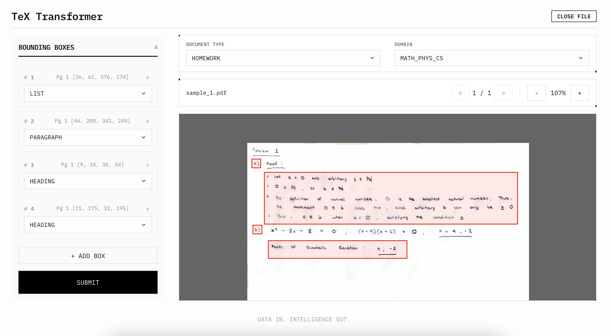
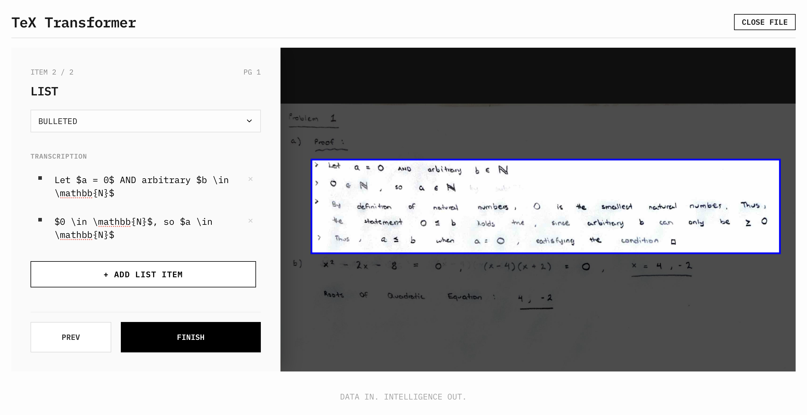

# TeX Transformer: Data Pipeline for LaTeX Model Training

A document processing pipeline that extracts PDF pages, classifies them using Mistral AI's Pixtral VLM, and provides a sleek web interface for manual annotation and dataset curation.

Current Version: **0.5.1**

## 💬 Features

TeX Transformer is under active development. It currently supports the following features:

- **Web Interface**: Modern UI for uploading PDFs, drawing bounding boxes, and typing accurate transcriptions.
- **Backend API**: Flask server handling PDF extraction, temporary storage, and dataset management.
- **AI Classification**: Automatic document classification using Mistral AI's Pixtral VLM.



Each document is first sorted into 1 of 6 document types:

- `homework`: Problems, exercises, assignments
- `notes`: Lecture notes, study summaries
- `assessment`: Exams, tests, quizzes
- `report`: Formal reports with structured sections
- `writing`: Essays, compositions
- `diagram`: Visual content (charts, graphs)

Then sorted into 1 of 4 academic domains:

- `math_phys_cs`: Mathematics, Physics, Computer Science
- `bio_chem_env`: Biology, Chemistry, Environmental Science
- `econ_business`: Economics, Business
- `humanities`: Languages, History, Social Sciences

The web interface allows for precise bounding box annotation of document elements, classified into the following types:

- `heading`: Structural headings (Chapter, Section, Subsection)
- `paragraph`: Standard blocks of text
- `list`: Bulleted or numbered lists
- `display_math`: Centered or standalone mathematical equations
- `table`: Tabular data structures
- `figure`: Images, diagrams, charts, and plots
- `code`: Source code blocks or algorithms
- `header_footer`: Page headers, footers, and page numbers

The user is then directed to transcribe the content of each bounding box and provide additional subtype information before pressing submit. The final output is a dataset entry with the input PDF, extracted `.png` images for every page, and a comprehensive `.json` transcribing labeling.



## 🐋 Docker Setup

### 1. Set up your API key

Create a `.env` file in the `backend/` directory:

```bash
echo "MISTRAL_API_KEY=your_mistral_api_key" > backend/.env
```

Or get your API key at: https://console.mistral.ai/

### 2. Run the application

Start the full stack (frontend + backend) using Docker Compose:

```bash
docker-compose up --build
```

### 3. Access the Interface

Open your browser and navigate to:
- **Frontend**: http://localhost:5173
- **Backend API**: http://localhost:5001

The application handles PDF uploads, page extraction, and annotation submission through the web interface.