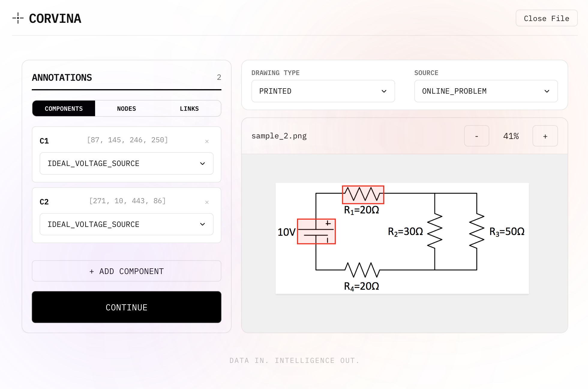

# CORVINA

A circuit annotation pipeline for building AI training datasets, built in TypeScript and Go. Provides a sleek web interface for labeling circuit components, nodes, and connections on hand-drawn or printed schematics.

Current Version: **0.1.1**

## 📟 Features

CORVINA is a purpose-built tool for curating circuit diagram datasets. It currently supports the following features:

- **Web Interface**: Modern UI for uploading circuit images, drawing component bounding boxes, placing nodes, defining connections, and transcribing associated text.
- **Backend API**: High-performance Go server handling image storage and structured dataset generation with zero external dependencies.
- **Structured Output**: Each annotated image produces a clean JSON file separating the circuit graph (components, nodes, connections) from text annotations with values and units.



## 📋 Annotation Pipeline

The annotation workflow is split into two phases:

**Phase 1 — Graph Annotation.** The user draws bounding boxes around circuit components, places nodes at junction points, and defines connections between them. Each element is classified:

- `component`: Circuit elements like resistors, capacitors, voltage sources — annotated with a bounding box and label
- `node`: Junction points in the circuit — annotated with a position
- `connection`: Wires linking components and nodes — defined by source and target IDs

**Phase 2 — Text Transcription.** The user identifies and transcribes text annotations on the circuit image, associating each with its corresponding component or node:

- `raw_text`: The literal text visible on the image (e.g., "10kΩ")
- `label_name`: A user-defined label for the component (e.g., "R1")
- `values`: Structured data with value, unit prefix, and unit suffix (e.g., `10`, `k`, `Ω`)

The final output is a dataset entry with the original `.png` image and a comprehensive `.json` file containing the circuit graph and all text annotations.

### Dataset Format

Each submission creates a directory in `dataset/` named after the image:

```
dataset/
└── circuit_01/
    ├── circuit_01.png       # Original image
    └── circuit_01.json      # Structured annotation data
```

The JSON file contains:

```json
{
  "image_file": "circuit_01.png",
  "classification": { "drawing_type": "handwritten", "source": "notebook" },
  "graph": {
    "components": [{ "id": "...", "label": "resistor", "bbox": [x1, y1, x2, y2] }],
    "nodes": [{ "id": "...", "position": [x, y] }],
    "connections": [{ "id": "...", "source_id": "...", "target_id": "..." }]
  },
  "text_annotations": [
    { "id": "...", "raw_text": "10k", "linked_to": "...", "label_name": "R1",
      "values": [{ "value": "10", "unit_prefix": "k", "unit_suffix": "Ohm" }] }
  ]
}
```

## 🐋 Docker Setup

### 1. Run the application

Start the full stack (frontend + backend) using Docker Compose:

```bash
docker compose up --build
```

### 2. Access the Interface

Open your browser and navigate to:
- **Frontend**: http://localhost:5173
- **Backend API**: http://localhost:5001

Upload a `.png` circuit image, annotate components and connections, transcribe text, and submit to generate a structured dataset entry.